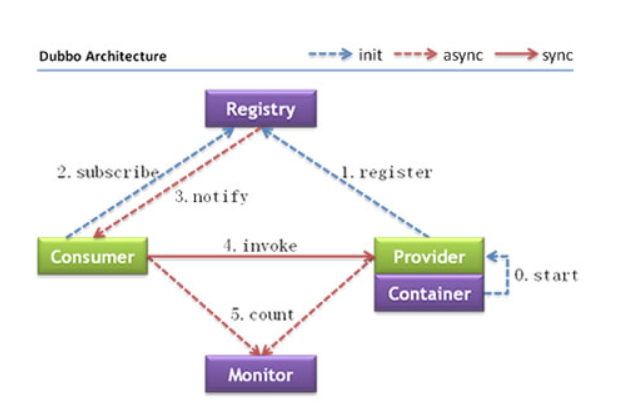

# 一、dubbo出现的原因

首先对着业务数据量的变大，业务系统之间的复杂，对于维护服务和服务的调用，已有的单体架构，垂直架构已无法满足当前的业务。

- 负载均衡，传统的nginx负载量太大
- 服务的配置管理变得复杂
- 服务器的容量，什么时候需要扩容，什么时候减掉

# 二、dubbo的架构分析

## 1.运行原理

1. 服务容器负责启动，加载，运行服务提供者。
2. 服务提供者在启动时，向注册中心注册自己提供的服务。
3. 服务消费者在启动时，向注册中心订阅自己所需的服务。
4. 注册中心返回服务提供者地址列表给消费者，如果有变更，注册中心将基于长连接推送变更数据给消费者。
5. 服务消费者，从提供者地址列表中，基于软负载均衡算法，选一台提供者进行调用，如果调用失败，再选另一台调用。
6. 服务消费者和提供者，在内存中累计调用次数和调用时间，定时每分钟发送一次统计数据到监控中心。

# 三、dubbo的理解

# 四、dubbo的常用场景